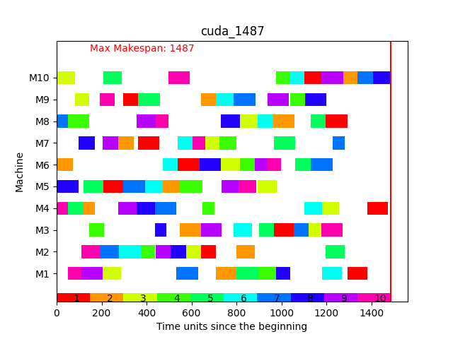

# Projekt z programowania równoległego

## Opis projektu

Problem JSSP polega na rozplanowaniu dla instancji $\mathcal{I}$
harmonogramu o minimalnym czasie wykonania $n$ prac $J_1,J_2,...,J_n$,
które wykorzystują $m$ maszyn $M_1,M_2,...,M_m$
o różnych czasach/koszcie operacji do ich pełnej realizacji.

Zmiennymi dla poszczególnych prac jest kolejność potrzebnych maszyn wraz z czasem/kosztem dla poszczególnych operacji.

W realizacji zadania zostały wykorzystane 2 biblioteki danych testowych, na których były testowane poniżej opisane
algorytmy,
jest to biblioteka problemów OR-Lib.

#### Zagadnienia

* Instancja $\mathcal{I}$ to taki zbiór informacji, który zapewnia wszystkie potrzebne dane do rozwiązywania problemu.
* Przestrzeń rozwiązań $\mathbb{Y}$ to zbiór wszystkich rozwiązań danego problemu.
* Przestrzeń eksploracyjna $\mathbb{X}$ jest to reprezentacja przestrzeni rozwiązań przygotowana pod eksplorację przez
  dany algorytm
* Rozwiązanie $y$ to pewne potencjalne rozwiązanie problemu optymalizacyjnego należącego do przestrzeni rozwiązań
  $\mathbb{Y}$
* Warunek jest to pewna zasada nałożona na przestrzeni rozwiązań $\mathbb{Y}$, która może być spełniona lub niespełniona
* Rozwiązanie $y$ jest wykonalny, gdy spełnia wszystkie warunki nałożone na przestrzeni rozwiązań $\mathbb{Y}$
* Rozwiązanie $y$ jest niewykonalny, gdy nie spełnia żadnego warunku nałożonego na przestrzeń rozwiązań $\mathbb{Y}$
* Kandydaci przestrzeni eksploracyjnej $x$ są to elementy należące do $\mathbb{X}$
* Mapowanie $\gamma:\mathbb{X}\rightarrow\mathbb{Y}$ jest relacją mapująca $x\in\mathbb{X}$ na $y\in\mathbb{Y}$
* Metaheurestyka jest to zgeneralizowany algorytm, który produkuje przybliżone rozwiązania dla różnych klas problemów
  optymalizacyjnych

Aby rozwiązanie kandydujące $y$ było wykonalne dla instancji $\mathcal{I}$ problemu JSSP musi spełniać 5 zasad wykresu
zadań Gantt'a.

- Wszystkie operacje na wszystkich pracach muszą mieć przyporządkowaną odpowiednią maszynę i muszą być wykonalne
- Tylko prace i maszyny specyfikowane przez instancję muszą wystąpić na wykresie
- Operacja musi być przyporządkowana do odpowiedniego okna czasu dla opowiadającej maszyny dokładnie na taki czas, na
  jaki jest operacja wykonywana na danej maszynie
- Operacje nie mogą się nakładać, czyli każda maszyna może wykonywać jedną pracę w tym samym czasie
- Warunki operacji muszą być uwzględnione; nie może wystąpić zakleszczenie

## Założenia projektu

- Wykorzystanie języka C++
- Wykorzystanie technologii OpenMPI
- Wykorzystanie technologii NVIDIA-Cuda

## Uruchamianie

### Wymagania

- C++ w standardzie 17
- Python 3.8+ Do wyświetlania harmonogramu
- Do części NVIDIA-cuda
    - Karta graficzna wspierająca CUDA
    - wersja CUDA >= 11.7
- Do części OpenMPI
    - system operacyjny linux

### Komendy

#### Wersja OpenMPI

- Budowanie

> make mp-build

- Instalacja

> make mp-run

- Skrót na obie operacje

> make mp instance=nazwa_instancji.txt

#### Wersja Cuda

- Budowanie

> make cuda-build

- Instalacja

> make cuda-run

- Skrót na obie operacje

> make cuda instance=nazwa_instancji.txt

#### Wyświetlanie harmonogramu wyniku

> python3 ./bin/gantt.py <odczyt: ścieżka_relatywna do folderu solutions> <tytuł: napis> <zapis: ścieżka_relatywna do folderu charts>

- Przykład

> python3 ./bin/gantt.py cuda_1487_abz5 cuda_1487 cuda_1487_abz5

